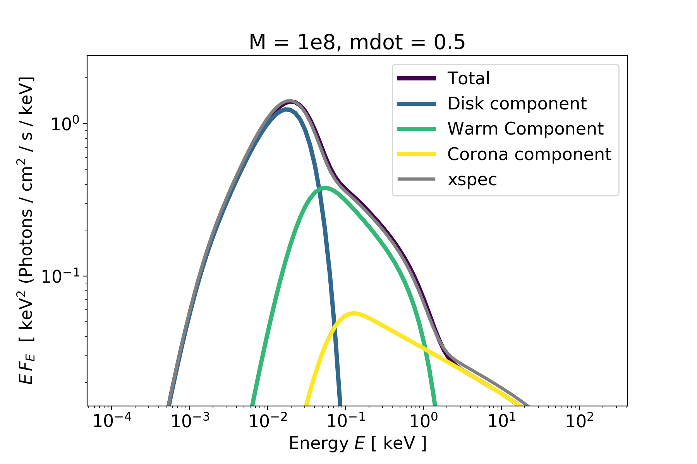
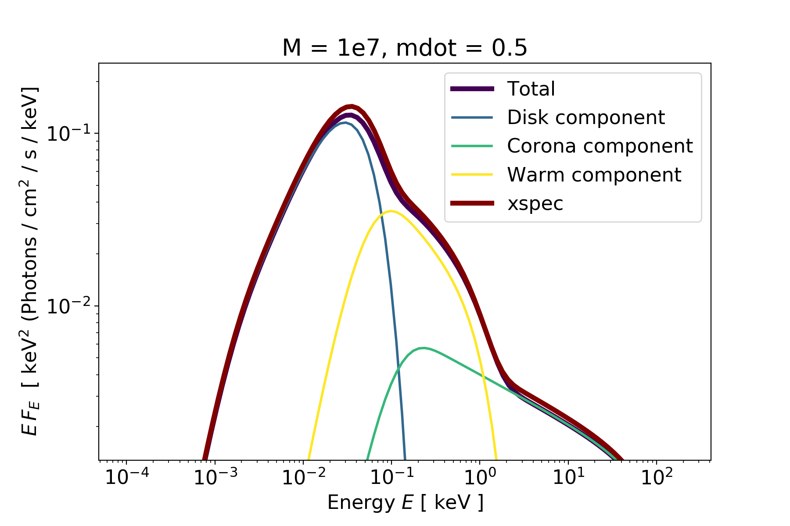

# PyAGN

This Python module handles various calculations involving the accretion physics of AGNs. In particular, it implements the [qsosed]("https://github.com/HEASARC/xspec_localmodels/tree/master/agnsed") model of Xspec, explained in [Kubota & Done (2018)]("https://arxiv.org/abs/1804.00171") to create the flux energy distribution in the UV/X-Ray band of an AGN.

the SED model has three characteristic regions: the outer standard
disc region; the warm Comptonising region; and the inner hot
Comptonising region.

For the warm Comptonising region, this model adopts the passive disc
scenario tested by Petrucci et al. 2018
(https://ui.adsabs.harvard.edu//#abs/2018A&A...611A..59P/abstract). Here,
the flow is assumed to be completely radially stratified, emitting as
a standard disc blackbody from Rout to Rwarm, as warm Comptonisation
from Rwarm to Rhot and then makes a transition to the hard X-ray
emitting hot Comptonisation component from Rhot to RISCO. The warm
Comptonisation component is optically thick, so is associated with
material in the disc. Nonetheless, the energy does not thermalise to
even a modified blackbody, perhaps indicating that significant
dissipation takes place within the vertical structure of the disc,
rather than being predominantly released in the midplane.

At a radius below Rhot, the energy is emitted in the hot
Comptonisation component. This has much lower optical depth, so it is
not the disc itself. In the model, the albedo is fixed at a = 0.3, and
the seed photon temperature for the hot Comptonisation component is
calculated internally. In contrast to optxagnf, this model does not
take the color temperature correction into account.

## Parameters for the SED class.

| parameter | type    | description                           |default         |
| --------- | ------- | ---------------------------------------|------------- |
| `M`     | float  | Black Hole mass in solar masses.       | 1e8
| `mdot`  | float | Black Hole accretion rate in Eddington units. | 0.5       |
| `astar` | float  | Black Hole dimensionless spin absolute value.                | 0   |
| `astar_sign`  | int | +1 for prograde rotation, -1 for retrograde. | +1 |
| `reprocessing`  | boolean | True to include reprocessing, False otherwise. | True |
| `hard_xray_fraction`  | float | Dissipated corona luminosity in Eddington units.  | 0.02 |
| `corona_electron_energy`  | float | Electron temperature for the hot Comptonisation component in keV | 100 |
| `warm_electron_energy`  | float | Electron temperature for the warm Comptonisation component in keV.  | 0.2 |
| `warm_photon_index`  | float | The spectral index $\Gamma$ of the warm Comptonisation component. | 2.5 |
| `reflection_albedo`  | float | reflection albedo for the reprocessed flux | 0.3 |

## Example usage.

```python
from pyagn import SED
from astropy import units as u

# initialize class
M = 1e8
mdot = 0.5
a = 0
sed_test = SED(M=M, mdot = mdot, astar = 0)

# choose a distance in cm.
distance = 100 * u.Mpc
distance_cm = distance.to(u.cm).value

# compute total flux
total_flux = sed_test.total_flux( distance = distance_cm)

# we can also easily plot the results

fig, ax = plt.subplots(9,6)
sed_test.plot_total_flux(distance, ax=ax)
```


## Comparison with Xspec

We can test that our Python implementation gives the same results as the Xspec code.

```
M = 1e8
mdot = 0.5
```


